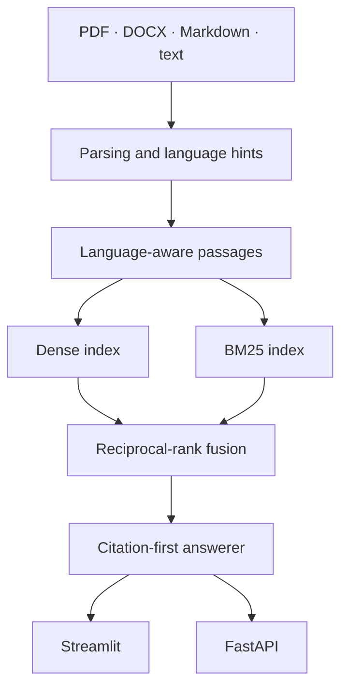

# Multilingual Document Intelligence

A citation-first document retrieval and question-answering system for **Arabic, Turkish, and English**. It ingests PDF, DOCX, Markdown, and text files; combines dense retrieval with BM25; returns traceable evidence; and refuses unsupported questions instead of guessing.

This is an applied-AI engineering project, not a production compliance system. The included documents are fictional technical examples created for reproducible testing.

**[Try the live demo](https://multilingual-document-intelligence.streamlit.app/)**


## What it does

1. Parses and validates uploaded documents.
2. Detects every supported language in a mixed file and creates language-aware,
   source-linked passages.
3. Ranks evidence using dense similarity and BM25 lexical search.
4. Uses calibrated hybrid evidence scoring with reciprocal-rank fusion as a
   stability tie-breaker.
5. Produces a grounded answer with numbered source citations.
6. Rejects weak or ambiguous evidence instead of forcing an answer.

The hosted demo uses a compact ONNX multilingual encoder, so a question in
Arabic can retrieve evidence from a Turkish or English passage. The offline
mode uses deterministic character n-grams, so the project remains runnable
without an API key or model download.

## Why this is more than a chat-with-PDF demo

| Concern | Implementation |
|---|---|
| Multilingual retrieval | Passage-level language detection plus ONNX embeddings for cross-language search |
| Exact terminology | BM25 lexical index preserves codes, thresholds, and domain terms |
| Rank stability | Reciprocal-rank fusion combines dense and lexical evidence |
| Traceability | Every answer includes document, passage ID, score, and PDF page when available |
| Hallucination control | Absolute evidence threshold, ambiguity margin, and citation validation |
| Measurability | Hit rate, mean reciprocal rank, and latency benchmark |
| Product surface | Streamlit workspace and FastAPI service |
| Engineering | Typed package, automated tests, linting, CI, and Docker |

## Architecture



## Interfaces

### Streamlit workspace

The interface supports document upload, a multilingual demo collection, grounded answers, source inspection, retrieval-weight exploration, and an evaluation view.

```bash
python -m venv .venv
source .venv/bin/activate  # Windows: .venv\Scripts\activate
pip install -e ".[app,semantic]"
streamlit run dashboard.py
```

### FastAPI service

```bash
pip install -e ".[app,semantic]"
uvicorn api:app --reload
```

Then open `http://127.0.0.1:8000/docs`.

| Method | Endpoint | Purpose |
|---|---|---|
| `GET` | `/health` | Service and index status |
| `POST` | `/documents/text` | Index supplied text |
| `POST` | `/documents/files` | Index PDF, DOCX, Markdown, or text files |
| `POST` | `/demo` | Load the fictional multilingual demo set |
| `POST` | `/search` | Inspect ranked passages and component scores |
| `POST` | `/ask` | Return an answer with citations |
| `DELETE` | `/documents` | Clear the in-memory session index |

Example:

```bash
curl -X POST http://127.0.0.1:8000/demo

curl -X POST http://127.0.0.1:8000/ask \
  -H "Content-Type: application/json" \
  -d '{"query":"When should the vibration warning be escalated?","top_k":5}'
```

## Retrieval modes

### Offline mode

The lightweight fallback is fast and fully local:

```bash
export DOCUMENT_AI_ENCODER=hashing
```

It is best for questions written in the same language as the evidence.

### Multilingual semantic mode

Install the semantic model dependency:

```bash
pip install -e ".[semantic,app]"
export DOCUMENT_AI_ENCODER=semantic
```

The default model is the ONNX-optimized
`sentence-transformers/paraphrase-multilingual-MiniLM-L12-v2` loaded through
FastEmbed. It can be replaced through `DOCUMENT_AI_EMBEDDING_MODEL`.

## Answer modes

The application is useful without an LLM. By default, it extracts the strongest supported statements and attaches numbered citations.

An optional OpenAI-compatible endpoint can generate a more conversational answer. The response is accepted only if it contains valid citations; otherwise the system returns the extractive fallback.

```bash
cp .env.example .env
# Set DOCUMENT_AI_BASE_URL, DOCUMENT_AI_API_KEY, and DOCUMENT_AI_MODEL privately.
```

Credentials are never committed, and no provider is required for the default workflow.

## Evaluation

The repository contains a small, transparent retrieval benchmark spanning all three languages:

```bash
python -m document_intelligence.evaluation --encoder hashing --top-k 3
python -m document_intelligence.evaluation --encoder semantic \
  --cases evaluation/queries_semantic.json --top-k 3
```

Reported metrics:

- **Hit rate@k:** whether a relevant source appears in the first *k* results
- **Mean reciprocal rank:** how early the first relevant source appears
- **Answer accuracy:** correct citation or correct refusal
- **Refusal accuracy:** unsupported questions rejected instead of guessed
- **Mean latency:** retrieval time per question on the current machine

The benchmark is intentionally small and should be treated as a regression check, not as a general claim about multilingual retrieval quality.

## Tests

```bash
pip install -e ".[dev]"
pytest
ruff check .
```

Tests cover mixed-language detection, deterministic chunking, exact-term and
cross-language retrieval, citations, calibrated confidence, unsupported-answer
behavior, API flows, and evaluation metrics.

## Docker

```bash
docker build -t multilingual-document-intelligence .
docker run --rm -p 8501:8501 multilingual-document-intelligence
```

The container uses semantic retrieval by default. The model is downloaded and
cached on first startup; no API key is required.

## Repository structure

```text
multilingual-document-intelligence/
├── .github/workflows/ci.yml
├── demo_docs/
├── evaluation/queries.json
├── src/document_intelligence/
│   ├── answering.py
│   ├── encoders.py
│   ├── engine.py
│   ├── evaluation.py
│   ├── ingestion.py
│   ├── language.py
│   ├── models.py
│   └── retrieval.py
├── tests/
├── api.py
├── dashboard.py
├── Dockerfile
└── pyproject.toml
```

## Design limitations

- The in-memory index is intended for a portfolio demonstration, not a multi-tenant deployment.
- OCR is not yet included; image-only PDFs require a separate extraction step.
- Language detection targets Arabic, Turkish, and English and is not a general
  classifier for every language.
- Cross-language embeddings can still be ambiguous; close matches are refused
  rather than presented as certain.
- The included evaluation collection is small and synthetic.
- Production use would require authentication, persistent vector storage, observability, and domain-specific evaluation.

These boundaries are documented deliberately: a trustworthy AI system should make its limits visible.

## Author

**Salsabeel Alfayoumi**  
Computer Engineer focused on Python, applied AI, data analysis, and intelligent systems.

[Portfolio](https://salfayoumi.github.io/) · [GitHub profile](https://github.com/salfayoumi) · [LinkedIn](https://www.linkedin.com/in/salsabeel-alfayoumi-4a04b53b9/)
